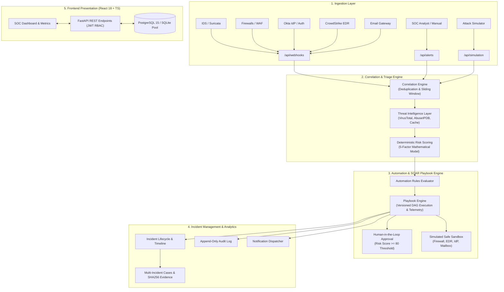
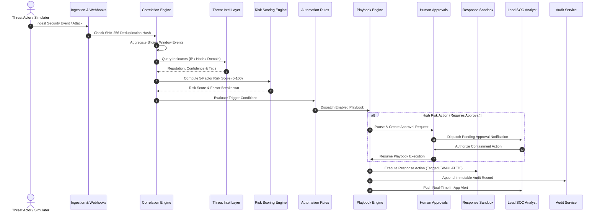

# SentinelFlow SOAR Platform Architecture

SentinelFlow is engineered with an enterprise-grade, modular, decoupled architecture providing reliable orchestration, real-time threat intelligence correlation, auditable execution telemetry, and safe containment simulation.

---

## 1. High-Level Architecture Diagram

---

## 2. End-to-End SOAR Execution Pipeline

---

## 3. Database Schema & Relationships

- **Users (`users`)**: Accounts with RBAC roles (`ADMIN`, `SOC_ANALYST`, `VIEWER`).
- **Alerts (`alerts`)**: Raw normalized alerts with `dedup_hash`, severity, source IP, host, and MITRE IDs.
- **Incidents (`incidents`)**: Triaged security incidents with risk scores, assigned analysts, status, and MITRE matrix links.
- **Incident Events (`incident_events`)**: Chronological audit trail of investigation notes and automated containment actions.
- **Playbooks (`playbooks`)**: Orchestration workflows with status toggle and versions.
- **Playbook Steps (`playbook_steps`)**: Ordered actions with parameters, approval flags, and retry thresholds.
- **Playbook Executions (`playbook_executions`)**: Execution telemetry tracking `duration_ms`, step outputs, and failures.
- **Approval Requests (`approval_requests`)**: Human authorization records tracking decision notes and approving user.
- **Cases (`cases`)**: Multi-incident investigation containers.
- **Case Evidence (`case_evidence`)**: Digital forensics artifacts with calculated SHA-256 integrity hashes.
- **Threat Indicators (`indicators`)**: Known IOCs with reputation, confidence, and source attribution.
- **Assets (`assets`)**: Infrastructure assets with criticality scores and isolation status.
- **Audit Logs (`audit_logs`)**: Tamper-evident append-only operation log.

---

## 4. Security & Safety Principles

1. **Deterministic Risk Calculations**: No random numbers for risk assessment; formula strictly produces 0–100 based on quantifiable factors.
2. **Safe Response Simulation**: All containment operations (Firewall IP blocks, host isolation, mailbox purges) execute within a memory-backed simulation sandbox and are clearly marked `[SIMULATED]`.
3. **Pluggable Live Intel with Mock Fallback**: Live VirusTotal v3 and AbuseIPDB v2 integrations when configured with API keys; high-fidelity realistic simulated intelligence when unconfigured.
4. **Append-Only Auditing**: Every system action, login attempt, configuration change, and containment authorization is indelibly recorded.
