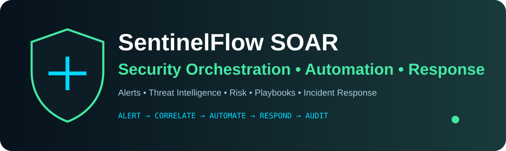
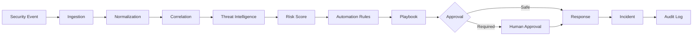

<div align="center">




[](https://fastapi.tiangolo.com/)
[](https://react.dev/)
[](https://www.postgresql.org/)
[](https://www.docker.com/)

### 🚨 Security Orchestration, Automation & Response

**A SOC-style platform connecting security events, intelligence, risk scoring, playbooks, approvals and auditable response workflows.**

</div>

---

## 🧠 What is SentinelFlow?

SentinelFlow demonstrates how a security operation can turn raw alerts into structured, reviewable workflows instead of treating detection, investigation and response as disconnected features.

## ⚡ Core Pipeline



## ✨ Capabilities

- 🔔 REST / webhook alert ingestion
- 🧩 Normalization, deduplication and correlation
- 🎯 Deterministic 0–100 risk scoring
- 🌐 Threat-intelligence provider adapters
- ⚙️ Ordered automation rules and playbooks
- 🧑‍💻 Human-in-the-loop approval for high-risk actions
- 🛡️ Safe response simulations
- 🕵️ Incident, case, evidence and timeline management
- 🎯 MITRE ATT&CK mapping
- 🔐 JWT authentication + RBAC
- 📋 Append-oriented audit logging

## 🧪 Attack Simulation Center

Controlled scenarios demonstrate the pipeline without attacking real infrastructure:

`Brute Force` · `Phishing` · `Malicious IP` · `Malware` · `Suspicious Login` · `Data Exfiltration` · `Impossible Travel` · `Suspicious PowerShell` · `Credential Stuffing` · `Malicious Domain`

## 🏗️ Architecture

```text
                 ┌──────────────────────┐
                 │   React SOC Console  │
                 └──────────┬───────────┘
                            │ REST / WS
                            ▼
                 ┌──────────────────────┐
                 │       FastAPI        │
                 └──────────┬───────────┘
                            │
       ┌────────────────────┼────────────────────┐
       ▼                    ▼                    ▼
   Detection          Intelligence          Automation
       │                    │                    │
       └────────────────────┼────────────────────┘
                            ▼
                  Risk / Incident Engine
                            │
                            ▼
                       PostgreSQL
```

## 🛠️ Stack

| Layer | Technology |
|---|---|
| Frontend | React 18, TypeScript, Vite, Tailwind CSS |
| UI | Lucide Icons, Recharts |
| Backend | Python 3.11+, FastAPI, Pydantic |
| Database | PostgreSQL, SQLAlchemy 2.x |
| Migrations | Alembic |
| Auth | JWT + password hashing |
| Testing | Pytest |
| Infrastructure | Docker + Docker Compose |

## 🚀 Quick Start

```bash
git clone https://github.com/wwwsahilchand123-maker/SentinelFlow-SOAR.git
cd SentinelFlow-SOAR
docker compose up --build
```

Typical services:

- Frontend: `http://localhost:3000`
- Backend: `http://localhost:8000`
- Swagger: `http://localhost:8000/docs`
- Health: `http://localhost:8000/api/health`

Stop:

```bash
docker compose down
```

## 🧪 Testing

```bash
cd backend
python -m pytest -v
```

## 📁 Project Map

```text
SentinelFlow-SOAR/
├── backend/       # API, models, services, tests
├── frontend/      # SOC dashboard
├── docker-compose.yml
├── ARCHITECTURE.md
├── API.md
├── SECURITY.md
└── .env.example
```

## 🔐 Security Principles

Secrets belong in environment variables. Authentication and authorization are enforced server-side. Uploaded evidence is untrusted input. Destructive response actions are simulated by default.

## 🗺️ Roadmap

- [x] SOC dashboard
- [x] Alert / incident management
- [x] Threat-intelligence abstraction
- [x] Risk scoring
- [x] Automation rules and playbooks
- [x] Safe response simulation
- [x] Human approval workflow
- [x] MITRE ATT&CK mapping
- [x] Audit logging
- [x] Docker deployment
- [ ] More production connectors
- [ ] Advanced background correlation

## ⚠️ Disclaimer

SentinelFlow is a cybersecurity engineering demonstration. Attack scenarios are controlled simulations. Use integrations only on systems and networks you are authorized to test or monitor.

---

<div align="center">

### 🚨 DETECT · ORCHESTRATE · AUTOMATE · RESPOND

**Built by Sahil Chand**

</div>
