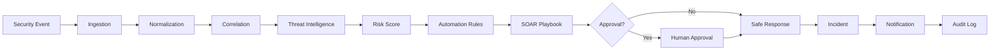

<div align="center">


[](https://fastapi.tiangolo.com/)
[](https://react.dev/)
[](https://www.postgresql.org/)
[](https://www.docker.com/)

### 🚨 Turn Security Events into Automated Response

**A full-stack SOAR platform demonstrating alert ingestion, threat intelligence, risk scoring, playbooks, incidents and safe response workflows.**

</div>

---

## 🧠 What is SentinelFlow?

SentinelFlow is a SOC-style Security Orchestration, Automation & Response platform. It connects security events to structured, auditable workflows instead of treating alerts, incidents and automation as separate screens.

## ⚡ Core Pipeline



## ✨ Key Capabilities

- 🔔 REST and webhook alert ingestion
- 🧩 Normalization, deduplication and correlation
- 🎯 Deterministic 0–100 risk scoring
- 🌐 VirusTotal / AbuseIPDB provider adapters with simulated fallback
- ⚙️ Automation rules and ordered playbooks
- 🧑‍💻 Human-in-the-loop approval for high-risk actions
- 🛡️ Safe response simulations such as IP block and endpoint isolation
- 🕵️ Incident, case, evidence and timeline management
- 🎯 MITRE ATT&CK mapping
- 🔐 JWT authentication and ADMIN / SOC_ANALYST / VIEWER RBAC
- 📋 Append-oriented audit logging

## 🧪 Attack Simulation Center

Controlled scenarios demonstrate the pipeline without attacking real infrastructure:

`Brute Force` · `Phishing` · `Malicious IP` · `Malware` · `Suspicious Login` · `Data Exfiltration` · `Impossible Travel` · `Suspicious PowerShell` · `Credential Stuffing` · `Malicious Domain`

## 🏗️ Architecture

```text
React SOC Dashboard
        │ REST / WebSocket
        ▼
      FastAPI
        │
        ├── Auth / RBAC
        ├── Alerts / Incidents / Cases
        ├── Correlation / Risk
        ├── Threat Intelligence
        ├── Rules / Playbooks
        ├── Approvals / Notifications
        └── Audit
        │
        ▼
   PostgreSQL
```

## 🛠️ Tech Stack

| Layer | Technology |
|---|---|
| Frontend | React 18, TypeScript, Vite, Tailwind CSS |
| UI | Lucide Icons, Recharts |
| Backend | Python 3.11+, FastAPI, Pydantic |
| ORM / DB | SQLAlchemy 2.x, PostgreSQL |
| Migrations | Alembic |
| Auth | JWT + password hashing |
| Testing | Pytest |
| Infrastructure | Docker + Docker Compose |

## 🚀 Quick Start

```bash
git clone https://github.com/wwwsahilchand123-maker/SentinelFlow-SOAR.git
cd SentinelFlow-SOAR
```

Configure your environment from `.env.example`, then:

```bash
docker compose up --build
```

Typical services:

- Frontend: `http://localhost:3000`
- Backend: `http://localhost:8000`
- Swagger: `http://localhost:8000/docs`
- Health: `http://localhost:8000/api/health`

Stop with:

```bash
docker compose down
```

## 🧪 Testing

```bash
cd backend
python -m pytest -v
```

## 📁 Project Structure

```text
SentinelFlow-SOAR/
├── backend/
│   ├── app/
│   │   ├── api/
│   │   ├── models/
│   │   ├── schemas/
│   │   ├── services/
│   │   └── main.py
│   ├── alembic/
│   └── tests/
├── frontend/
├── docker-compose.yml
├── ARCHITECTURE.md
├── API.md
├── SECURITY.md
└── .env.example
```

## 🔐 Security Principles

Secrets stay in environment variables, authentication and authorization are enforced server-side, uploaded evidence is treated as untrusted input, and destructive response actions are simulated by default.

## 🗺️ Roadmap

- [x] SOC dashboard
- [x] Alert / incident management
- [x] Threat-intelligence abstraction
- [x] Risk scoring
- [x] Automation rules and playbooks
- [x] Safe response simulation
- [x] Human approval workflow
- [x] MITRE ATT&CK mapping
- [x] Audit logging
- [x] Docker deployment
- [ ] More production connectors
- [ ] Advanced correlation and background execution

## ⚠️ Disclaimer

SentinelFlow is a cybersecurity engineering and automation demonstration project. The included attack scenarios are controlled simulations. Use the platform and integrations only on systems and networks you are authorized to test or monitor.

---

<div align="center">

### 🚨 Detect. Orchestrate. Automate. Respond.

**Built by Sahil Chand**

</div>
