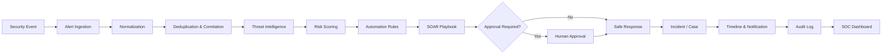

# 🛡️ SentinelFlow SOAR

### Security Orchestration, Automation & Response Platform

SentinelFlow is a full-stack SOAR platform built to demonstrate how a modern Security Operations Center can turn security events into structured, automated response workflows.

It brings together **alert ingestion, normalization, correlation, threat-intelligence enrichment, deterministic risk scoring, automation rules, playbook execution, incident/case management, human approval, safe response simulation, MITRE ATT&CK mapping, notifications, and audit logging** in one SOC-style interface.

> **Portfolio note:** External response actions are intentionally simulated by default. Threat-intelligence integrations can use live providers when configured, while the local fallback is explicitly marked as simulated.

---

## 🚨 The Core SOAR Pipeline



The important part is that this is designed as an **end-to-end workflow**, not just a collection of disconnected dashboard pages.

---

## ✨ Key Capabilities

### 🔔 Alert Operations
- REST and webhook-based security-event ingestion
- Normalized alert model
- Severity classification
- Deduplication
- Alert search, filtering and triage
- Analyst assignment

### 🔎 Correlation & Risk
- Time-window event correlation
- Indicator/host/IP/user relationships
- Deterministic 0–100 risk scoring
- Risk-factor breakdowns
- Asset criticality and incident-history signals

### 🌐 Threat Intelligence
- Pluggable provider architecture
- VirusTotal integration support
- AbuseIPDB integration support
- Local simulated intelligence fallback
- Indicator reputation and confidence
- Lookup caching

### ⚙️ SOAR Automation
- Automation rules
- Ordered playbook steps
- Playbook execution telemetry
- Execution status and step-level logs
- Retry/error handling
- Playbook versioning
- Dry-run/test execution concepts

### 🧑‍💻 Human-in-the-Loop Response
High-risk actions can require analyst approval before execution.

Supported safe response simulations include:

- IP blocking
- Endpoint isolation
- User disablement
- Password reset
- Email quarantine

These operate in the application's **simulation environment** rather than against real infrastructure.

### 🕵️ Investigation
- Incident lifecycle management
- Multi-incident cases
- Incident timeline
- Indicators
- Assets
- Evidence metadata and SHA-256 integrity tracking
- MITRE ATT&CK technique mapping

### 📋 Governance
- JWT authentication
- ADMIN / SOC_ANALYST / VIEWER roles
- Backend-enforced RBAC
- Append-only audit trail
- Notifications
- Security analytics and reporting

---

## 🧪 Attack Simulation Center

SentinelFlow includes controlled simulations for demonstrating the automation pipeline without attacking real systems.

| Scenario | Demonstrates |
|---|---|
| Brute Force | Alert → correlation → risk → playbook → simulated IP block |
| Phishing | Email/URL enrichment → incident → simulated quarantine |
| Malicious IP | Threat intelligence → risk → perimeter response simulation |
| Malware | Hash analysis → approval → simulated endpoint isolation |
| Suspicious Login | Authentication anomaly → response workflow |
| Data Exfiltration | High-risk event → human approval workflow |
| Impossible Travel | Geographic login anomaly detection |
| Suspicious PowerShell | Execution-related detection workflow |
| Credential Stuffing | Repeated authentication attack correlation |
| Malicious Domain | Domain reputation and response workflow |

### Example

```text
Simulate Brute Force
        ↓
Alert Created
        ↓
Normalize + Deduplicate
        ↓
Correlation
        ↓
Threat Intelligence
        ↓
Risk Score
        ↓
Automation Rule
        ↓
Brute Force Playbook
        ↓
Simulated Firewall Block
        ↓
Incident Timeline
        ↓
Notification
        ↓
Audit Log
```

---

## 🧱 Architecture

```text
┌──────────────────────────────────────────────────────────┐
│                    React SOC Dashboard                   │
│ Alerts │ Incidents │ Playbooks │ Cases │ Reports │ TI   │
└──────────────────────────┬───────────────────────────────┘
                           │ REST API
┌──────────────────────────▼───────────────────────────────┐
│                         FastAPI                           │
│ Auth │ RBAC │ Alerts │ Incidents │ Cases │ Reports       │
├──────────────────────────────────────────────────────────┤
│                    SOAR Service Layer                    │
│ Correlation │ Risk │ Threat Intel │ Rules │ Playbooks   │
│ Approvals │ Notifications │ Safe Response │ Audit       │
└──────────────────────────┬───────────────────────────────┘
                           │ SQLAlchemy / Alembic
┌──────────────────────────▼───────────────────────────────┐
│                       PostgreSQL                          │
│ Alerts │ Incidents │ Indicators │ Assets │ Cases         │
│ Playbooks │ Executions │ Rules │ Approvals │ Audit Logs  │
└──────────────────────────────────────────────────────────┘
```

---

## 🛠️ Tech Stack

| Layer | Technology |
|---|---|
| Frontend | React 18, TypeScript, Vite, Tailwind CSS |
| UI | Lucide Icons, Recharts |
| Backend | Python 3.11+, FastAPI, Pydantic |
| ORM | SQLAlchemy 2.x |
| Migrations | Alembic |
| Database | PostgreSQL |
| Authentication | JWT + password hashing |
| Testing | Pytest |
| Infrastructure | Docker + Docker Compose |
| Threat Intelligence | VirusTotal / AbuseIPDB adapters + simulated fallback |

---

## 🚀 Quick Start

### 1. Clone

```bash
git clone https://github.com/wwwsahilchand123-maker/SentinelFlow-SOAR.git
cd SentinelFlow-SOAR
```

### 2. Configure environment

```bash
cp .env.example .env
```

On Windows PowerShell:

```powershell
Copy-Item .env.example .env
```

Fill in the required local configuration. **Never commit `.env` or real API keys.**

### 3. Start with Docker

```bash
docker compose up --build
```

Services:

- Frontend: `http://localhost:3000`
- Backend API: `http://localhost:8000`
- Swagger: `http://localhost:8000/docs`
- Health: `http://localhost:8000/api/health`

### 4. Stop

```bash
docker compose down
```

For a clean database reset during local development:

```bash
docker compose down -v
```

---

## 🔐 Demo Roles

| Role | Purpose |
|---|---|
| `ADMIN` | Full platform administration and configuration |
| `SOC_ANALYST` | Alert triage, incident response and investigations |
| `VIEWER` | Read-only security visibility |

For local development, use the credentials documented by the seed configuration rather than embedding credentials in source code.

---

## 🧠 Risk Scoring

SentinelFlow uses deterministic scoring rather than random severity values.

The model considers factors such as:

- Alert severity
- Threat-intelligence reputation
- Asset criticality
- Behavioral velocity
- Previous incident history

Final score:

```text
0–30    LOW
31–60   MEDIUM
61–80   HIGH
81–100  CRITICAL
```

The purpose is to make automated security decisions **repeatable and auditable**.

---

## 🎯 MITRE ATT&CK Coverage

The project includes mappings for representative techniques including:

- `T1566` — Phishing
- `T1059` — Command and Scripting Interpreter
- `T1110` — Brute Force
- `T1078` — Valid Accounts
- `T1071` — Application Layer Protocol
- `T1568` — Dynamic Resolution
- `T1048` — Exfiltration Over Alternative Protocol
- `T1486` — Data Encrypted for Impact

---

## 🧪 Testing

Run the backend test suite:

```bash
cd backend
python -m pytest -v
```

The most important integration path to verify is:

```text
Alert
 → Correlation
 → Threat Intelligence
 → Risk Scoring
 → Automation Rule
 → Playbook
 → Approval (when required)
 → Safe Response
 → Incident
 → Notification
 → Timeline
 → Audit Log
```

---

## 🔒 Security Principles

- Secrets belong in environment variables, not source code.
- `.env` should never be committed.
- Authentication and authorization are enforced server-side.
- User-supplied automation rules must never be executed with arbitrary Python `eval()`.
- Uploaded evidence is treated as untrusted input.
- Destructive security actions are simulated by default.
- Audit history is designed to be append-only from the normal application workflow.
- Live and simulated threat-intelligence results are explicitly distinguished.

---

## 📁 Project Structure

```text
SentinelFlow-SOAR/
├── backend/
│   ├── app/
│   │   ├── api/
│   │   ├── models/
│   │   ├── schemas/
│   │   ├── services/
│   │   └── main.py
│   ├── alembic/
│   ├── tests/
│   └── requirements.txt
├── frontend/
│   ├── src/
│   │   ├── components/
│   │   ├── pages/
│   │   ├── services/
│   │   └── types/
│   └── package.json
├── docker-compose.yml
├── ARCHITECTURE.md
├── API.md
├── SECURITY.md
└── .env.example
```

---

## 📸 Screenshots

Add screenshots/GIFs here after capturing the final running application. Recommended showcase order:

1. SOC Dashboard
2. Alert Details
3. Incident Timeline
4. Playbook Execution
5. Threat Intelligence
6. Attack Simulation Center
7. Approval Workflow
8. Audit Logs

---

## 🗺️ Roadmap

- [x] SOC dashboard
- [x] Alert and incident management
- [x] Threat-intelligence abstraction
- [x] Deterministic risk scoring
- [x] Automation rules
- [x] SOAR playbooks
- [x] Safe response simulation
- [x] Human approval workflow
- [x] MITRE ATT&CK mapping
- [x] Audit logging
- [x] Docker deployment
- [ ] Production-grade external connector ecosystem
- [ ] Background job/queue execution for long-running playbooks
- [ ] Advanced detection correlation
- [ ] Additional SOC integrations

---

## ⚠️ Disclaimer

SentinelFlow is a cybersecurity engineering and automation demonstration project. The included attack scenarios are controlled simulations intended for local testing. Do not use the platform or its integrations to access, disrupt, or modify systems without authorization.

---

## 📄 License

MIT License.
